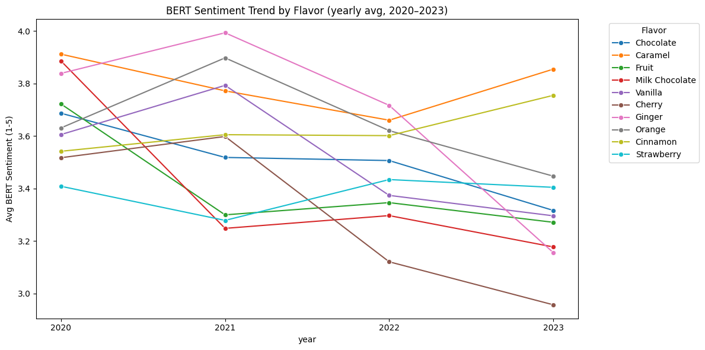
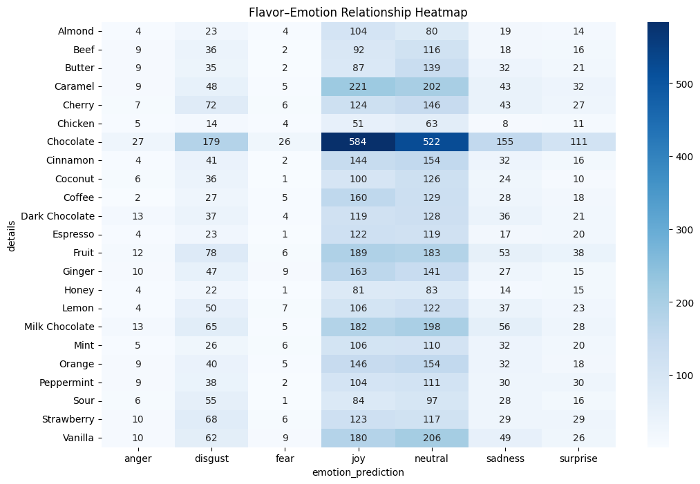
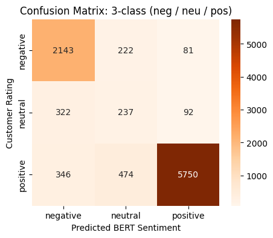
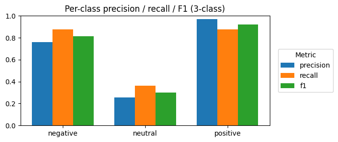

# Flavor Trends for Nestlé

## Project Snapshot

- **Host company:** Nestlé
- **Description:** Analyze public product and review data to uncover emerging flavor trends, consumer sentiment, and high-potential flavor combinations to support the creation of innovative products that keep Nestlé ahead of the competition.

## Project Overview

- **Objective:** Identify flavors that are gaining popularity, measure how consumers feel about those flavors over time, and predict promising flavor combinations for product development.
- **Scope & Motivation:** Using large-scale public review datasets (Amazon Reviews 2023) to extract product flavor metadata, merge it with review text and star ratings, performs exploratory data analysis and time-series analysis, and applies NLP models (BERT sentiment, emotion classifiers) to surface actionable insights for Nestlé.
- **Business Relevance:** The insights help Nestlé prioritize flavor development, reduce product risk, and better match marketing messages to consumer sentiment and emotions.

## Team Members

| Name | GitHub | Contributions |
|---|---|---|
| Samiha Zaman | [samihazaman](https://github.com/samihazaman) | Sentiment analysis (BERT model) & visualization |
| Eman Arsham | [EmanArsham](https://github.com/EmanArsham) | Initial cleaning steps and EDA |


## Project Highlights

- **Identified top flavors:** e.g., Caramel, Chocolate, Cinnamon — prioritized by review count and trend growth.
- **Sentiment & emotion insights:** Applied BERT sentiment and DistilRoBERTa emotion models to surface changing consumer sentiment (2020–2023).
- **Time-series flavor trends:** Smoothed rating trends and yearly sentiment aggregates reveal emerging or declining flavor interest.
- **Model validation:** Compared model-inferred sentiment to customer star ratings (confusion matrices and per-class precision/recall).

## Repository Structure

- **Nestle.ipynb**: Main project notebook
- **requirements.txt**: Python dependencies
- **Install.md**: Installation instructions 

## Setup — VS Code Virtual Environment (Windows / PowerShell)

1. Open the project folder in VS Code.
2. Create a virtual environment:

```powershell
python -m venv .venv
```

3. Activate the environment in PowerShell:

```powershell
.\.venv\Scripts\Activate.ps1
```

4. In VS Code, open the Command Palette (Ctrl+Shift+P) → "Python: Select Interpreter" → choose the interpreter in .venv.
5. Install dependencies (see Install.md section below):

```powershell
python -m pip install --upgrade pip
python -m pip install -r requirements.txt
```

Note: If using the notebook kernel, you can run the install cell at the top of Nestle.ipynb which runs %pip install -U -r requirements.txt -q.

## Installation (from Install.md)

This project uses a requirements.txt for reproducible Python package installs.

Recommended: install from the terminal (PowerShell)

```powershell
python -m pip install --upgrade pip
python -m pip install -r requirements.txt
```

Alternative: install from inside the notebook

```python
# Installs packages into the current Jupyter kernel's environment
%pip install -U -r requirements.txt -q
```

Notes:
- Use python -m pip to ensure the correct interpreter is targeted.
- %pip magic is preferred inside notebooks so packages go to the kernel environment.
- requirements.txt currently contains CPU-only PyTorch wheels; for GPU, adjust the torch install line per PyTorch docs.

## Data Exploration

- **Dataset used:**
	- McAuley-Lab/Amazon-Reviews-2023 (Hugging Face). The notebook downloads product meta and review jsonl files for Grocery & Gourmet Food.

- **Structure & size:** 
    - Product metadata (fields like average_rating, rating_number, details->Flavor, parent_asin) and review data (fields like parent_asin, rating, text, timestamp).
    - Sampled reviews (a reproducible sample of ~500k records for scalable exploratory data analysis).

- **Preprocessing & cleaning:**
	- Extracted Flavor from product details and dropped missing values.
	- Filtered to top N flavors by review count and removed irrelevant labels (e.g., "Original", "Assorted").
	- Merged product meta with review records on parent_asin and dropped unneeded columns.
	- Converted timestamps to datetime and created year_month / month features.
	- Applied minimum-review thresholds (e.g., flavors with >= 30 reviews) to reduce noise.

- **EDA insights & visualizations:**
	- Smoothed rating trends per flavor (FacetGrid small-multiples) to identify stable vs. rising/declining flavors.
	- Average rating bar plots for top flavors.
	- BERT sentiment yearly trends per flavor (line plots and FacetGrid).
	- Emotion heatmap showing flavor-to-emotion distribution (e.g., joy, sadness, anger).



*Figure 1 — Yearly average BERT sentiment per flavor (2020–2023)*



*Figure 2 — Counts of predicted emotions by flavor (heatmap). Darker = more reviews expressing that emotion.*


## Model Development

- **Approach & justification:**
	- Use pretrained transformer pipelines for fast, robust sentiment and emotion extraction: nlptown/bert-base-multilingual-uncased-sentiment (1–5 star style labels) and j-hartmann/emotion-english-distilroberta-base (emotion classification).
	- Reason: pretrained models provide strong out-of-the-box performance for consumer text at scale and avoid costly end-to-end training.
    
- **Technical pipeline:**
	1. Text preprocessing and batching with truncation to 512 tokens.
	2. Run sentiment pipeline in batches; extract integer star labels where possible to create bert_sentiment_score.
	3. Aggregate sentiment by flavor and time period (year/month), compute rolling means for smoothing.
	4. Run emotion classifier and aggregate counts per flavor/month; visualize via heatmaps and time series.
	5. Baseline comparison: map numeric product ratings to sentiment categories (neg/neu/pos) and build confusion matrices vs. BERT outputs; compute per-class precision/recall/F1.

## Code Highlights

- **Nestle.ipynb**: End-to-end exploration including data download (Hugging Face), preprocessing, exploratory data analysis, visualization, sentiment and emotion pipelines, and model evaluation.

## Results & Key Findings

- **Top flavors and trends:** The analysis surfaces the most-reviewed flavors and their smoothed rating trends (2020–2023). Use the FacetGrid outputs to identify rising flavors for prioritization.
- **Sentiment outcomes:** BERT sentiment trends by flavor show year-to-year shifts; model often agrees with customer ratings (notebook notes ~87.5% agreement on positive-class in one analysis), with confusion matrices available for 5-class and 3-class analyses.
- **Emotion signals:** Emotion heatmaps highlight which flavors evoke particular emotions (e.g., joy, trust) that can inform marketing tone.

### BERT Model Performance





## Discussion & Reflection

- **What worked:** Leveraging pretrained NLP pipelines enabled rapid, interpretable sentiment and emotion signals at scale; smoothing and minimum-review thresholds helped reduce noise.
- **What didn’t / limitations:** Review text truncation to 512 tokens can lose context; BERT sentiment is an inferred proxy and not a ground truth. Product metadata flavor labels are noisy and require manual filtering.
- **Mitigations:** Increase review sampling diversity, refine flavor extraction with rule-based or model-assisted cleaning, and consider fine-tuning sentiment models with in-domain labels if available.

## Next Steps

- Expand flavor combination analysis (co-occurrence of flavor keywords in product metadata and reviews) to recommend promising pairings.
- Experiment with fine-tuning sentiment models on labeled in-domain samples to improve agreement with human judgments.
- Expand analysis to other flavor categories beyond chocolate and caramel
- Incorporate social media data (Twitter, Instagram, TikTok) to capture viral flavor trends earlier
- Build automated alert system when specific flavors show rapid sentiment growth


## How to Reproduce

1. Follow the VS Code venv steps above and install requirements.txt.
2. Open notebooks/Nestle.ipynb and run cells in order. Run the install cell first if you prefer installing into the notebook kernel.

---

